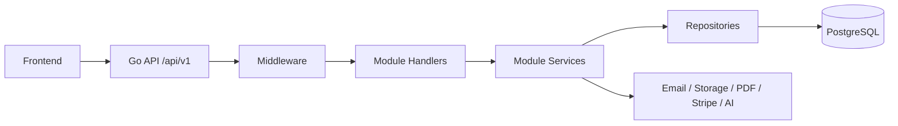

# ContApp Backend API And Architecture

This document defines the backend API contract for ContApp2.

Source documents:

- `docs/full_desc.txt`
- `docs/contapp_database.dbml`
- `docs/tasks.txt`

ContApp is a multi-organisation SaaS workspace for small and medium businesses
across multiple industries. The backend must support a free base workspace plus
paid extension packages such as Contracts Pro, Ticketing Pro, HR Pro, Internal
Chat, Legislation Monitor, and AI Assistant.


## Backend Direction

Use a modular monolith first.

Recommended stack:

- Language: Go
- Router: `github.com/go-chi/chi/v5`
- Database: PostgreSQL
- Migrations: goose SQL migrations
- Auth: JWT access token plus persisted refresh sessions
- API base path: `/api/v1`
- File storage: local filesystem in development, S3-compatible object storage
  in production

The backend should keep technical infrastructure separate from business
modules:

```text
backend/
  cmd/
    api/
    migrate/
    worker/
  configs/
  migrations/
  storage/
  internal/
    app/
    config/
    platform/
    modules/
    testing/
```

Business modules own their handlers, DTOs, services, repository code, models,
and tests. Shared infrastructure belongs under `internal/platform`.


## Request Flow



Middleware should handle:

- request id
- structured logging
- panic recovery
- CORS
- auth
- organisation scope
- permission checks
- feature/extension guards
- usage limit guards


## Actors And Organisation Scope

The backend has two login actor kinds:

- `admin`: platform administrator, outside any organisation
- `account`: global user login identity

Organisation access is represented by `organisation_memberships`. A person logs
in through one global account and then works inside one active organisation
membership.

Rules:

- Most business data belongs to an organisation.
- Organisation-scoped resources must always be filtered by `organisation_id`.
- User endpoints must not trust `organisation_id` from request bodies.
- Every organisation request must verify the account has an active membership
  in the selected organisation.
- The access token should include `account_id`, `organisation_id`, and
  `membership_id` after an organisation context is selected.
- Platform admin endpoints may access cross-organisation data only through
  explicit admin permissions.
- Public signing endpoints are unauthenticated and use high-entropy public
  tokens stored only as hashes.

Decision:

- Use global `accounts` plus `organisation_memberships`.
- Keep `admins` separate from normal accounts.
- Product-facing "users" inside an organisation are membership records.
- Roles attach to memberships, not directly to global accounts.


## Response Conventions

Normal response:

```json
{
  "data": {},
  "message": "ok"
}
```

Create response:

```json
{
  "data": { "id": 123 },
  "message": "created"
}
```

Error response:

```json
{
  "error": true,
  "message": "human-readable error",
  "code": "optional_machine_code"
}
```

Standard status codes:

- `200` read/update success
- `201` create success
- `202` accepted async action
- `204` delete success with no body
- `400` invalid input
- `401` not authenticated
- `403` authenticated but not allowed
- `404` not found or outside organisation scope
- `409` conflict
- `410` public invite expired/revoked
- `422` valid JSON but invalid business state
- `500` server error


## Feature Packages

Base package:

- dashboard
- organisation/user management
- employee categories
- roles and permissions
- notebook
- personal/shared notes
- organisation-wide documents
- basic planner/calendar
- billing overview

Paid extensions:

- Contracts Pro
- Ticketing Pro
- HR Pro
- Internal Chat
- Legislation Monitor
- AI Assistant
- Multi-Site Teams, future extension

Feature gates should be enforced in backend middleware or service guards, not
only in the frontend.


## Target API Surface

All paths below are under `/api/v1`.


### Health

| Method | Path | Purpose |
| --- | --- | --- |
| GET | `/health` | API health check |


### Auth

| Method | Path | Purpose |
| --- | --- | --- |
| POST | `/auth/user/login` | organisation user login |
| POST | `/auth/admin/login` | platform admin login |
| POST | `/auth/refresh-token` | rotate refresh session and access token |
| POST | `/auth/logout` | revoke refresh session |
| GET | `/auth/me` | current actor profile, organisation, roles, permissions, enabled features |
| GET | `/auth/organisations` | list organisations available to current account |
| POST | `/auth/switch-organisation` | switch active organisation membership |

Recommended login response:

```json
{
  "data": {
    "access_token": "...",
    "actor": {
      "type": "account",
      "account_id": 1,
      "organisation_id": 10,
      "membership_id": 50
    },
    "permissions": [],
    "features": []
  }
}
```


### Platform Admin

Platform admin endpoints require admin actor permissions.

| Method | Path | Purpose |
| --- | --- | --- |
| GET | `/admin/overview` | platform dashboard |
| GET | `/admin/organisations` | list/search organisations |
| POST | `/admin/organisations` | create organisation |
| GET | `/admin/organisations/{id}` | read organisation |
| PUT | `/admin/organisations/{id}` | update organisation |
| DELETE | `/admin/organisations/{id}` | soft delete organisation |
| GET | `/admin/users` | cross-organisation user search |
| GET | `/admin/features` | list feature definitions |
| PUT | `/admin/organisations/{id}/features` | manually activate/deactivate features |
| GET | `/admin/events` | audit event search |
| GET | `/admin/jobs` | job run history |
| POST | `/admin/jobs/{name}/run` | manually trigger job |


### Organisation, Users, Roles

In this API section, "user" means an organisation membership backed by a global
account.

Roles are organisation-scoped. Permissions are global. Default roles are seeded
per organisation and then assigned to memberships.

| Method | Path | Purpose |
| --- | --- | --- |
| GET | `/organisation` | current organisation profile |
| PUT | `/organisation` | update current organisation |
| GET | `/organisation/settings` | read organisation settings |
| PUT | `/organisation/settings` | update organisation settings |
| GET | `/employee-categories` | list employee categories |
| POST | `/employee-categories` | create employee category |
| PUT | `/employee-categories/{id}` | update employee category |
| DELETE | `/employee-categories/{id}` | delete employee category |
| GET | `/users` | list organisation users |
| POST | `/users` | create/invite organisation user |
| GET | `/users/{id}` | read user |
| PUT | `/users/{id}` | update user |
| DELETE | `/users/{id}` | soft delete user |
| GET | `/roles` | list roles |
| POST | `/roles` | create organisation role |
| PUT | `/roles/{id}` | update role |
| DELETE | `/roles/{id}` | delete role |
| GET | `/permissions` | list permissions |
| PUT | `/roles/{id}/permissions` | replace role permissions |
| PUT | `/users/{id}/roles` | replace user roles |


### Dashboard

| Method | Path | Purpose |
| --- | --- | --- |
| GET | `/dashboard/overview` | workspace KPIs, recent activity, upcoming deadlines |

Response example:

```json
{
  "data": {
    "kpis": {
      "users": 0,
      "clients": 0,
      "active_contract_invites": 0,
      "open_tickets": 0,
      "unread_notifications": 0
    },
    "recent_activity": [],
    "upcoming": []
  }
}
```


### Documents

Organisation-wide documents are part of the base package.

| Method | Path | Purpose |
| --- | --- | --- |
| GET | `/documents` | list organisation documents |
| POST | `/documents` | upload organisation document |
| GET | `/documents/{id}` | read document metadata |
| GET | `/documents/{id}/download` | download document bytes |
| PUT | `/documents/{id}` | update document metadata |
| DELETE | `/documents/{id}` | soft delete document |
| GET | `/files/{id}` | read file metadata |

Storage rules:

- Database stores metadata and object key.
- File bytes live outside PostgreSQL.
- Every download must enforce organisation ownership.


### Notebook

Notebook is part of the base package.

| Method | Path | Purpose |
| --- | --- | --- |
| GET | `/notebook/documents` | list notebook documents |
| POST | `/notebook/documents` | create notebook document |
| GET | `/notebook/documents/{id}` | read notebook document |
| PUT | `/notebook/documents/{id}` | update notebook document |
| DELETE | `/notebook/documents/{id}` | soft delete notebook document |


### Notes

Simple task management is removed. Notes remain a base feature.

Database model:

- Use only `workspace_notes`.
- `visibility = personal | shared`.
- `owner_user_id` points to `organisation_memberships.id`.
- `organisation_id` scopes the note.
- `client_id` is optional and available when the note is linked to a client.

| Method | Path | Purpose |
| --- | --- | --- |
| GET | `/notes` | list personal/shared notes |
| POST | `/notes` | create note |
| GET | `/notes/{id}` | read note |
| PUT | `/notes/{id}` | update note |
| DELETE | `/notes/{id}` | soft delete note |


### Planner

Basic planner/calendar is part of the base package. AI smart planning requires
AI Assistant.

| Method | Path | Purpose | Feature |
| --- | --- | --- | --- |
| GET | `/planner/events` | list planner events | Base |
| POST | `/planner/events` | create planner event | Base |
| GET | `/planner/events/{id}` | read planner event | Base |
| PUT | `/planner/events/{id}` | update planner event | Base |
| DELETE | `/planner/events/{id}` | soft delete planner event | Base |
| GET | `/planner/smart` | list generated smart plans | AI Assistant |
| POST | `/planner/smart` | generate smart plan | AI Assistant |


### Billing And Extensions

| Method | Path | Purpose |
| --- | --- | --- |
| GET | `/billing/overview` | current plan, active extensions, limits, usage |
| GET | `/billing/plans` | public list of active plans/extensions |
| POST | `/billing/checkout` | create Stripe checkout session |
| POST | `/billing/portal` | create Stripe billing portal session |
| POST | `/billing/webhook` | Stripe webhook, raw body required |
| GET | `/features` | current organisation enabled features |
| GET | `/features/usage` | current usage counters |

Entitlement precedence:

1. Manual/custom organisation override
2. Active subscription plan features
3. Feature default limits

Decision:

- `organisation_features` is the effective entitlement table.
- Runtime feature guards read `organisation_features`.
- Runtime limit guards read `organisation_feature_limits` plus usage counters.
- Billing, admin actions, trials, and custom deals do not directly become
  scattered feature checks. They update/reconcile the effective entitlement
  tables.

Reconciliation inputs:

- active subscriptions
- plan_features
- feature_definitions.default_limits_json
- manual admin overrides
- trial grants
- custom deal grants

Reconciliation outputs:

- organisation_features
- organisation_feature_limits

The reconciliation process should be idempotent and safe to run after Stripe
webhooks, admin changes, trial expiration, and scheduled billing sync jobs.


### Clients - Contracts Pro

Client management is available only when Contracts Pro is active.

Current product definition:

- client means external customer
- client can be a physical person or a client company
- future meanings such as partner, supplier, lead, project, or external
  collaborator are out of scope for the first stage

Recommended database model before migrations:

- Use one `clients` table with `client_type = person | company`.
- Keep person-specific fields nullable for company clients.
- Keep company-specific fields nullable for person clients.
- Contracts, documents, notes, and tickets should all link to `clients.id`.

| Method | Path | Purpose |
| --- | --- | --- |
| GET | `/clients` | list/search clients |
| POST | `/clients` | create client |
| GET | `/clients/{id}` | read client |
| PUT | `/clients/{id}` | update client |
| DELETE | `/clients/{id}` | soft delete client |
| GET | `/clients/{id}/documents` | list client documents |
| POST | `/clients/{id}/documents` | upload client document |
| GET | `/clients/{id}/documents/{documentId}/download` | download client document |
| DELETE | `/clients/{id}/documents/{documentId}` | delete client document |

Recommended client payload shape:

```json
{
  "client_type": "company",
  "first_name": null,
  "last_name": null,
  "cnp": null,
  "company_name": "Example SRL",
  "cui": "RO12345678",
  "tva": true,
  "responsible_name": "Ana Popescu",
  "responsible_email": "ana@example.com",
  "email": "office@example.com",
  "phone": "+40000000000",
  "address": "Business address"
}
```


### Contracts - Contracts Pro

| Method | Path | Purpose |
| --- | --- | --- |
| GET | `/contracts/templates` | list templates |
| POST | `/contracts/templates` | create template |
| GET | `/contracts/templates/{id}` | read template |
| PUT | `/contracts/templates/{id}` | update template |
| DELETE | `/contracts/templates/{id}` | soft delete template |
| GET | `/contracts/invites` | list invite pipeline |
| POST | `/contracts/invites` | create invite |
| GET | `/contracts/invites/{id}` | read invite |
| PUT | `/contracts/invites/{id}` | update invite |
| POST | `/contracts/invites/{id}/send` | send invite link |
| POST | `/contracts/invites/{id}/revoke` | revoke invite link |
| POST | `/contracts/invites/{id}/remind` | send reminder |
| DELETE | `/contracts/invites/{id}` | soft delete invite |
| GET | `/contracts/submissions` | list signed submissions |
| GET | `/contracts/submissions/{id}` | read submission |
| GET | `/contracts/submissions/{id}/pdf` | download final PDF |
| GET | `/contracts/submissions/{id}/signature` | download signature image |
| DELETE | `/contracts/submissions/{id}` | soft delete submission |

Contract lifecycle:

```text
template -> invite draft -> sent -> viewed -> signed -> final PDF
                         -> revoked
                         -> expired
```

Template field rule:

- Dynamic fields live inside `contract_templates.content_json`.
- Do not create a separate `template_fields` table for stage one.
- The editor and public signing flow should read field definitions from
  `content_json`.


### Public Signing - Contracts Pro

These endpoints are public and must not require normal auth.

| Method | Path | Purpose |
| --- | --- | --- |
| GET | `/public/sign/{token}` | resolve invite, template content, client hint |
| POST | `/public/sign/{token}` | submit filled fields and signature image |

Token rules:

- Generate a high-entropy random token.
- Store only the token hash.
- Return raw token only when creating/sending the invite.
- Expired or revoked invites return `410 Gone`.
- Rate-limit public signing endpoints.

Example response:

```json
{
  "data": {
    "invite": {
      "id": 1,
      "status": "viewed",
      "expiration_date": "2026-05-01T00:00:00Z",
      "remarks": ""
    },
    "template": {
      "id": 1,
      "name": "Service Agreement",
      "contract_type": "general"
    },
    "content": {
      "type": "doc",
      "content": []
    },
    "client_hint": {
      "name": "Example Client",
      "email": "client@example.com"
    }
  }
}
```


### Ticketing - Ticketing Pro

Simple personal tasks are removed. Work tracking is handled through Ticketing
Pro.

Canonical endpoint naming should use `tickets`, not `tasks`.

| Method | Path | Purpose |
| --- | --- | --- |
| GET | `/ticketing/tickets` | list tickets |
| POST | `/ticketing/tickets` | create ticket |
| GET | `/ticketing/tickets/{id}` | read ticket |
| PUT | `/ticketing/tickets/{id}` | update ticket |
| POST | `/ticketing/tickets/{id}/claim` | claim ticket |
| POST | `/ticketing/tickets/{id}/complete` | complete ticket |
| POST | `/ticketing/tickets/{id}/refuse` | refuse/release ticket |
| POST | `/ticketing/tickets/{id}/archive` | archive ticket |

Temporary compatibility aliases may be added only if the current frontend still
uses `/ticketing/tasks`. New backend code should use ticket terminology.


### Internal Chat - Internal Chat Extension

First-stage chat is internal only between organisation users.

| Method | Path | Purpose |
| --- | --- | --- |
| GET | `/chat/conversations` | list conversations |
| POST | `/chat/conversations` | create conversation |
| GET | `/chat/conversations/{id}` | read conversation |
| GET | `/chat/conversations/{id}/messages` | list messages |
| POST | `/chat/conversations/{id}/messages` | send message |
| POST | `/chat/conversations/{id}/read` | mark conversation read |

Client/external participant chat is a future extension and should remain
disabled until explicitly implemented.


### HR - HR Pro

HR is internal only for the organisation's own employees.

| Method | Path | Purpose |
| --- | --- | --- |
| GET | `/hr/hours` | list working hour records |
| POST | `/hr/hours` | submit working hours |
| PUT | `/hr/hours/{id}` | update working hours |
| POST | `/hr/hours/{id}/approve` | approve hours |
| POST | `/hr/hours/{id}/reject` | reject hours |
| GET | `/hr/leaves` | list leave requests |
| POST | `/hr/leaves` | request leave |
| POST | `/hr/leaves/{id}/approve` | approve leave |
| POST | `/hr/leaves/{id}/reject` | reject leave |
| GET | `/hr/reviews` | list employee reviews |
| POST | `/hr/reviews` | create employee review |
| GET | `/hr/certificates` | list certificate requests |
| POST | `/hr/certificates` | request employee/income certificate |
| POST | `/hr/certificates/{id}/complete` | attach generated certificate |


### Legislation - Legislation Monitor

Legislation preferences are organisation-level for stage one.

| Method | Path | Purpose |
| --- | --- | --- |
| GET | `/legislation/updates` | list legislation/news updates |
| GET | `/legislation/preferences` | read organisation preferences |
| PUT | `/legislation/preferences` | update organisation preferences |

AI summaries and topic digests require AI Assistant in addition to Legislation
Monitor.


### AI - AI Assistant

AI Assistant is billed separately and should be usage tracked.

| Method | Path | Purpose |
| --- | --- | --- |
| POST | `/ai/summarize` | summarize text or legislation update |
| POST | `/ai/topic-digest` | create topic digest |
| POST | `/chat/derive-ticket` | derive ticket from chat conversation |
| POST | `/planner/smart` | generate smart plan |

AI logging rules:

- Track provider, model, feature, status, and usage.
- Avoid storing sensitive full prompts unless retention and redaction are
  explicitly defined.
- Store hashes/metadata when possible.


### Notifications

| Method | Path | Purpose |
| --- | --- | --- |
| GET | `/notifications` | list notifications for current user |
| POST | `/notifications` | create notification, internal/admin use |
| POST | `/notifications/{id}/read` | mark one notification read |
| POST | `/notifications/read-all` | mark all current user's notifications read |
| DELETE | `/notifications/{id}` | delete notification |


### Audit And Jobs

| Method | Path | Purpose |
| --- | --- | --- |
| GET | `/events` | list organisation audit events |
| GET | `/jobs` | list visible job runs, admin only or restricted |
| POST | `/admin/jobs/{name}/run` | manually trigger job, platform admin only |

Audit events should be append-only.


## Database Architecture Summary

The visual schema is maintained in `docs/contapp_database.dbml`.

Main table groups:

- identity: admins, accounts, organisation memberships, employee categories,
  roles, permissions, sessions
- organisations: organisations, organisation settings
- billing/extensions: plans, features, subscriptions, feature limits, usage,
  Stripe events
- clients: external customers, gated by Contracts Pro
- documents: files, organisation documents, client documents, signatures
- contracts: templates, fields, invites, submissions, contract numbers
- notes/notebook/planner: base workspace productivity
- ticketing: structured team tickets
- chat: internal conversations and messages
- HR: hours, leave, reviews, certificate requests
- legislation: updates and organisation-level preferences
- AI: request tracking and usage
- audit/jobs: events and job runs
- future extensions: custom fields, workflows, automations, integrations,
  webhooks, teams, branches, locations

Important DB rules:

- Use `organisation_id` on every organisation-scoped table.
- Use partial unique indexes in SQL where records are soft-deleted.
- DBML can show logical uniqueness, but PostgreSQL migrations must convert
  those indexes to partial unique indexes when `deleted_at` exists.
- Store file bytes outside PostgreSQL.
- Store public signing tokens only as hashes.
- Keep audit events append-only.
- Use transactions for public signing, contract numbering, PDF generation,
  Stripe webhook processing, and usage counter increments.

Partial unique index examples:

```sql
create unique index employee_categories_org_name_unique
  on employee_categories (organisation_id, lower(name))
  where deleted_at is null;

create unique index accounts_email_unique
  on accounts (lower(email))
  where deleted_at is null;

create unique index organisation_memberships_account_unique
  on organisation_memberships (organisation_id, account_id)
  where deleted_at is null;

create unique index clients_org_email_unique
  on clients (organisation_id, lower(email))
  where email is not null and deleted_at is null;

create unique index clients_org_cnp_unique
  on clients (organisation_id, cnp)
  where cnp is not null and deleted_at is null;

create unique index clients_org_cui_unique
  on clients (organisation_id, cui)
  where cui is not null and deleted_at is null;

create unique index contract_submissions_org_number_unique
  on contract_submissions (organisation_id, contract_number)
  where contract_number is not null and deleted_at is null;
```


## Migration Priorities

Future extension tables may remain in `docs/contapp_database.dbml` for design
visibility, but they should not all be implemented in migration one. Add them
later through package-specific migrations when each extension is implemented.

Recommended initial migration groups:

1. organisations and organisation settings
2. platform admins, accounts, memberships, employee categories, roles,
   permissions, sessions
3. billing and extension activation foundation
4. base workspace: documents, notebook, notes, planner, notifications
5. Contracts Pro: clients, templates, invites, submissions, public signing
6. Ticketing Pro if needed for demo
7. audit events and job runs

Later migrations:

- HR Pro
- Internal Chat
- Legislation Monitor
- AI Assistant request tracking
- custom fields
- custom workflows
- automations
- integrations
- webhooks
- teams, branches, locations
- projects


## Background Jobs

Use a simple worker process or in-process scheduler first.

Jobs:

- expire contract invites past `expiration_date`
- send contract reminders
- generate PDFs if async
- import legislation updates
- send legislation digests
- reconcile Stripe subscriptions from webhook events
- cleanup expired refresh sessions
- cleanup orphan files
- cleanup old temporary data

Every job should:

- be idempotent
- write job run metadata
- write audit events for important business actions
- have structured logs
- have a manual admin trigger where useful


## Security Requirements

- Keep refresh cookies HttpOnly.
- Use Secure cookies in production.
- Support explicit local development cookie config.
- Hash public signing tokens.
- Rate-limit auth and public signing.
- Validate and size-limit signature images.
- Enforce organisation scope in every repository query.
- Enforce feature gates in backend code.
- Enforce usage limits transactionally where usage is counted.
- Never return files outside the actor's organisation scope.
- Audit important actions:
  - login failures above threshold
  - role and permission changes
  - feature activation/deactivation
  - invite send/revoke/view/submit
  - PDF generation
  - file download
  - billing changes
  - admin cross-organisation actions


## Implementation Phases

Use `docs/tasks.txt` as the detailed implementation checklist.

High-level order:

1. Product/API/DB decisions
2. Database foundation
3. Backend foundation
4. Auth, organisations, users, roles
5. Free base workspace
6. Billing and extension system
7. Contracts Pro
8. Ticketing Pro
9. Optional paid extensions
10. Security, deployment, CI


## Definition Of Done

For each endpoint:

- Route exists under `/api/v1`.
- Request DTO is validated.
- Organisation scope is enforced.
- Permission is checked.
- Feature gate is checked when the endpoint belongs to a paid extension.
- Usage limit is checked when the endpoint consumes limited usage.
- Repository query has tests where logic is non-trivial.
- Handler has success and failure tests.
- Response shape matches frontend expectations.
- Errors use the standard JSON shape.
- API is documented in this file.
