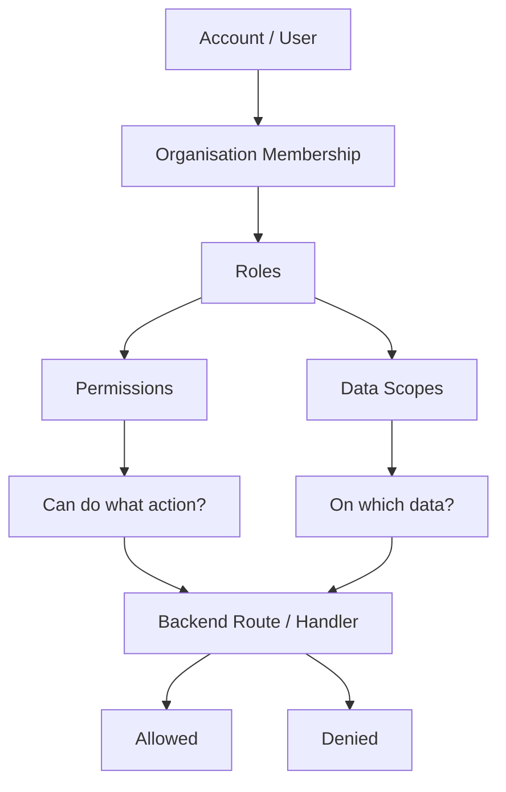
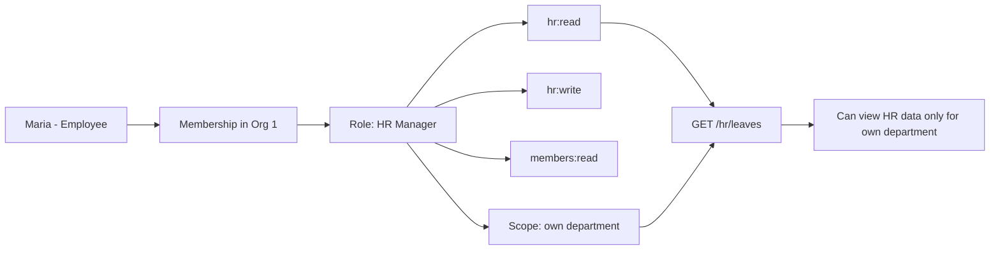
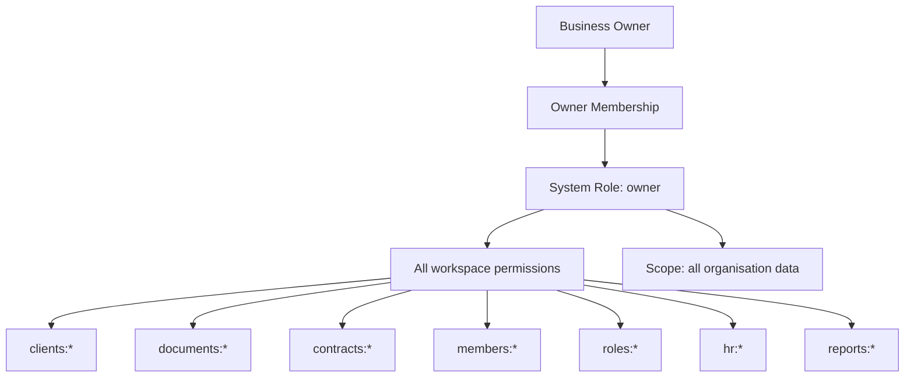
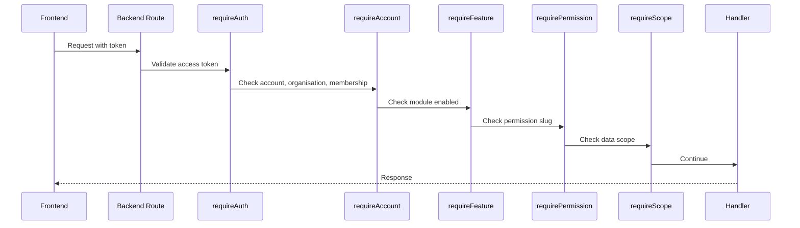
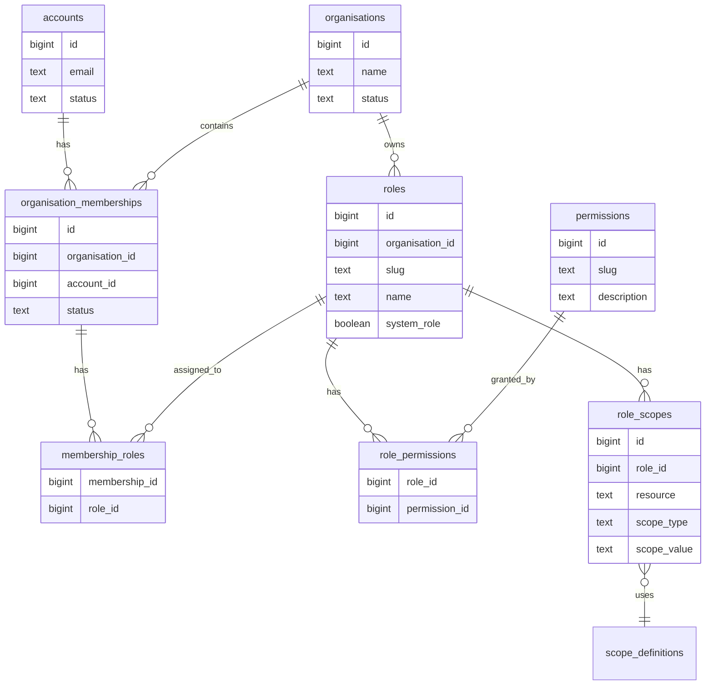
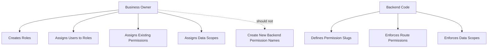

# RBAC Target Model

This document shows the recommended direction for permissions, roles, scopes,
and business-owner access.

## High Level Model



The core idea:

```txt
Permission = what action can the user do?
Scope = which data can the user do it on?
Role = named bundle of permissions and scopes.
```

## Concrete Example



## Business Owner



Important owner rules:

- Owner role cannot be deleted.
- Owner permissions cannot be removed.
- Last owner cannot be demoted or removed.
- Every organisation should always have at least one active owner.
- Owner has full access inside its organisation, not platform-admin access.

## Backend Request Flow



Recommended request decision order:

1. Authenticate token.
2. Confirm actor type.
3. Confirm organisation membership.
4. Confirm feature is enabled for the organisation.
5. Confirm permission exists for the membership.
6. Confirm data scope allows access to the target records.
7. Run handler.

## Database Shape



## Responsibility Split



Business owner manages:

- users
- role names
- role assignments
- existing permission assignments
- data scopes

Backend owns:

- permission definitions
- route enforcement
- scope enforcement
- owner-role safety rules
- platform-admin separation

## Recommended Target

```txt
Business Owner
  -> full organisation access
  -> can create users
  -> can create roles
  -> can assign backend-defined permissions
  -> can assign data scopes

Role
  -> permissions
  -> scopes

Permission
  -> action
  -> examples: clients:read, documents:write, hr:read

Scope
  -> data boundary
  -> examples: all, own, assigned, department, category
```

## Sustainable Backend Rules

### Permissions

Permissions must be backend-defined. The frontend can list and assign
permissions, but it must not create new permission slugs.

Good:

```txt
clients:read
clients:write
documents:read
hr:read
reports:read
```

Bad:

```txt
can_view_blue_clients
custom_permission_from_ui
permission_for_client_123
```

### Roles

Business owner can create roles, but only using existing permissions.

Example custom roles:

- Accountant
- HR Manager
- Sales Agent
- Viewer
- Contract Manager

### Scopes

Use scopes when access depends on which records the user can see.

Examples:

| Scope | Meaning |
| --- | --- |
| `all` | All organisation data for that resource. |
| `own` | Records created by or owned by the user. |
| `assigned` | Records assigned to the user. |
| `department` | Records inside a department. |
| `category` | Records inside a category. |

Do not create one permission per record. That does not scale.

## Implementation Plan

1. Stop creating permissions from role-save requests.
2. Validate role permissions against backend-defined permissions.
3. Protect the `owner` system role from deletion or permission changes.
4. Add last-owner protection.
5. Add missing dedicated module permissions.
6. Move routes away from overloaded `members:*` permissions.
7. Add `role_scopes`.
8. Add `requireScope` or repository-level scoped query helpers.
9. Add tests for owner safety, permission denial, and scoped data access.

