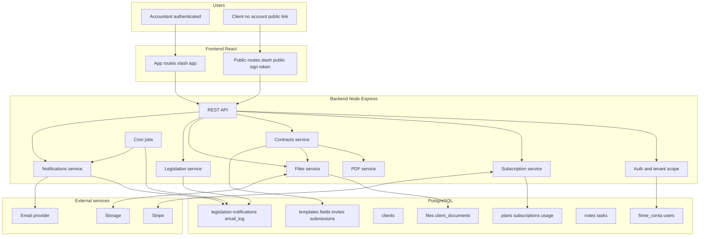
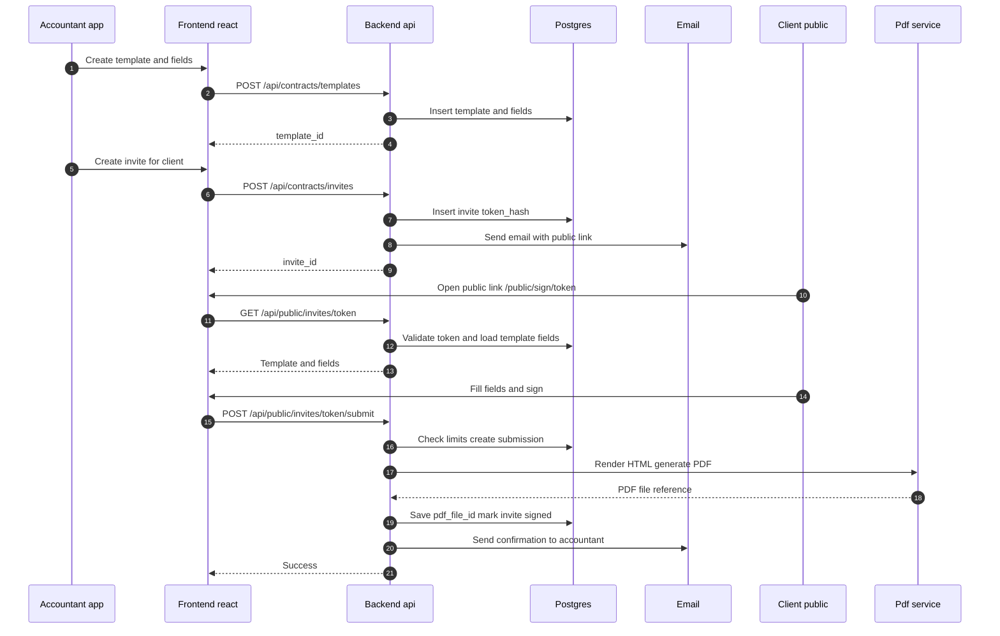

<<<<<<< HEAD
# ContApp (Pilot) — Contracte + Clienți + PDF + Reminders + Dossier + Notes/Tasks + Legislație + Subscription


# Release Notes

## v0.0.1 (2025-02-22)

**Lansare pilot — ContApp**

### Site public
- Landing page: hero, secțiuni funcționalități, testimonialuri, cum funcționează
- Prețuri: Free (0 lei), Starter (29 lei), Pro (69 lei), Business (149 lei), Enterprise
- FAQ, CTA pentru înregistrare

### App (mock)
- Dashboard client — overview, invites, semnături, KPI
- Dashboard admin — overview tenant, contracte, notificări
- Autentificare (login, register)
- Plan Free: 3 șabloane, 5 semnări/lună, PDF automat

### Stack
- React + Vite + TypeScript
- Tailwind CSS, Motion
- Mock API (frontend-only)

---

Aplicație web pentru contabili care permite:
- crearea contractelor într-un editor rich text cu **câmpuri dinamice** (text, semnătură client, semnătură contabil, semnătură fizică/blank),
- trimiterea contractelor către clienți prin **link public securizat** (clientul nu are cont),
- colectarea semnăturilor (digital sau fizic), generarea și descărcarea **PDF final**,
- gestionarea clienților și a dosarului de documente,
- notes + to-do + dashboard cu overview,
- monitorizare schimbări legislative cu notificări + email digest,
- model de subscription: **Free + 4 planuri plătite** (Stripe).

Stack: **React + Node.js + Express + PostgreSQL** (+ Stripe, email provider, storage).

---

## Funcționalități (Pilot)

### 1) Subscription (Free + 4 planuri plătite)
- plan curent per firmă (cabinet)
- limite + feature flags (ex. max submissions/lună, max clienți, dosar client, reminders, legislație)
- Stripe Checkout + Webhook + Billing Portal

### 2) Contracte (Template → Invite → Submission → PDF)
- editor contract (Tiptap) cu câmpuri:
  - `____` → field text completat de client (`client_text`)
  - `....` → field semnătură client (`client_signature`)
  - `::::` → field semnătură fizică (în PDF rămâne gol) (`physical_signature_blank`)
  - `----` → field semnătură contabil (`accountant_signature`)
- câmpurile pot fi inserate și prin UI (sidebar “Fields”)
- contabilul își salvează semnătura și o reutilizează automat
- invite public securizat (token) trimis pe email
- reminder manual + automat (cron)
- PDF final generat backend (HTML → PDF cu Puppeteer) și disponibil la download

### 3) Clienți / Firme client
- listă clienți ai contabilului
- asignare contract (invite) către client + notificare email

### 4) Dashboard
- overview: pending invites, deadline-uri, ultimele semnături
- usage vs limite plan

### 5) Dosar client / documente
- upload / download / delete documente per client

### 6) Carnetel de notițe + To-do list
- notes (global sau per client)
- tasks (global sau per client) cu due date + reminder opțional

### 7) Legislație
- listă actualizări (titlu, sursă, dată, domeniu, link)
- preferințe pe domenii + frecvență (instant/daily/weekly)
- notificări in-app + digest email (cron)

---

## API (pilot)

### Auth
- `POST /api/auth/register`
- `POST /api/auth/login`
- `POST /api/auth/logout`
- `GET  /api/auth/me`

### Subscription
- `GET  /api/subscription`
- `POST /api/subscription/checkout`
- `POST /api/subscription/webhook` (raw body)
- `POST /api/subscription/portal`

### Settings (semnatura contabil)
- `GET  /api/settings/signature`
- `PUT  /api/settings/signature`

### Clients + Dossier
- `GET    /api/clients`
- `POST   /api/clients`
- `GET    /api/clients/:id`
- `PUT    /api/clients/:id`
- `DELETE /api/clients/:id`
- `GET    /api/clients/:id/documents`
- `POST   /api/clients/:id/documents` (multipart)
- `GET    /api/clients/:id/documents/:docId/download`
- `DELETE /api/clients/:id/documents/:docId`

### Contracts
- `GET  /api/contracts/templates`
- `POST /api/contracts/templates`
- `GET  /api/contracts/templates/:id`
- `PUT  /api/contracts/templates/:id`
- `GET  /api/contracts/invites`
- `POST /api/contracts/invites`
- `POST /api/contracts/invites/:id/remind`
- `POST /api/contracts/invites/:id/revoke`
- `GET  /api/contracts/submissions`
- `GET  /api/contracts/submissions/:id`
- `GET  /api/contracts/submissions/:id/pdf`

### Public signing (client)
- `GET  /api/public/invites/:token`
- `POST /api/public/invites/:token/submit`

### Notes
- `GET    /api/notes`
- `POST   /api/notes`
- `PUT    /api/notes/:id`
- `DELETE /api/notes/:id`

### Tasks
- `GET    /api/tasks`
- `POST   /api/tasks`
- `PUT    /api/tasks/:id`
- `DELETE /api/tasks/:id`

### Legislation + Notifications
- `GET  /api/legislation/updates`
- `GET  /api/legislation/preferences`
- `PUT  /api/legislation/preferences`
- `GET  /api/notifications`
- `POST /api/notifications/:id/read`

### Jobs (cron)
- Contract reminders (deadline apropie / nesemnat de X zile)
- Legislation digest (daily/weekly)
- Optional: task reminders
- Cleanup: invites expirate + fisiere orphan (optional)

### Security notes (pilot)
- Public token: stocat in DB ca hash (nu token raw)
- Expirare + revoke invite
- Rate limiting pe rutele publice
- Auth contabil: cookies httpOnly
- Audit minim pentru actiuni critice (invite, remind, revoke, submit)

---

## Arhitectura



---

## Flux



---

## Model date

```mermaid
erDiagram
  FIRME_CONTA ||--o{ USERS : has
  FIRME_CONTA ||--o{ CLIENTS : has
  FIRME_CONTA ||--o{ SUBSCRIPTIONS : has
  SUBSCRIPTION_PLANS ||--o{ SUBSCRIPTIONS : references

  FIRME_CONTA ||--o{ CONTRACT_TEMPLATES : has
  CONTRACT_TEMPLATES ||--o{ CONTRACT_TEMPLATE_FIELDS : has
  CONTRACT_TEMPLATES ||--o{ CONTRACT_INVITES : has
  CONTRACT_INVITES ||--o{ CONTRACT_SUBMISSIONS : creates

  CLIENTS ||--o{ CONTRACT_INVITES : optional
  CLIENTS ||--o{ CLIENT_DOCUMENTS : has

  FIRME_CONTA ||--o{ FILES : has
  CONTRACT_SUBMISSIONS ||--o{ FILES : pdf_and_signatures
  CLIENT_DOCUMENTS ||--|| FILES : uses

  FIRME_CONTA ||--o{ NOTES : has
  FIRME_CONTA ||--o{ TASKS : has

  FIRME_CONTA ||--o{ NOTIFICATIONS : has
  USERS ||--o{ USER_LEGISLATION_PREFERENCES : has

  FIRME_CONTA {
    uuid id PK
    uuid owner_user_id FK
    text name
    uuid accountant_signature_file_id FK
    timestamptz created_at
  }

  USERS {
    uuid id PK
    uuid firme_conta_id FK
    text email
    text password_hash
    text full_name
    text stripe_customer_id
    timestamptz created_at
  }

  CLIENTS {
    uuid id PK
    uuid firme_conta_id FK
    text name
    text type
    text cui
    text email
    timestamptz created_at
  }

  SUBSCRIPTION_PLANS {
    uuid id PK
    text slug
    text stripe_price_id
    jsonb limits_json
    jsonb features_json
  }

  SUBSCRIPTIONS {
    uuid id PK
    uuid firme_conta_id FK
    uuid plan_id FK
    text status
    text stripe_subscription_id
    timestamptz current_period_end
  }

  CONTRACT_TEMPLATES {
    uuid id PK
    uuid firme_conta_id FK
    text title
    jsonb editor_json
    text status
    timestamptz created_at
  }

  CONTRACT_TEMPLATE_FIELDS {
    uuid id PK
    uuid template_id FK
    text field_key
    text field_type
    text pdf_label_before
    text client_label
    boolean required
    int order_index
  }

  CONTRACT_INVITES {
    uuid id PK
    uuid firme_conta_id FK
    uuid template_id FK
    uuid client_id FK
    text token_hash
    text signer_email
    timestamptz deadline_at
    text status
    int reminder_count
    timestamptz created_at
  }

  CONTRACT_SUBMISSIONS {
    uuid id PK
    uuid firme_conta_id FK
    uuid invite_id FK
    jsonb field_values_json
    uuid final_pdf_file_id FK
    timestamptz submitted_at
  }

  FILES {
    uuid id PK
    uuid firme_conta_id FK
    text category
    text storage_key_or_path
    text mime_type
    bigint size_bytes
    timestamptz created_at
  }

  CLIENT_DOCUMENTS {
    uuid id PK
    uuid firme_conta_id FK
    uuid client_id FK
    uuid file_id FK
    text doc_type
    timestamptz created_at
  }

  NOTES {
    uuid id PK
    uuid firme_conta_id FK
    uuid client_id FK
    text title
    jsonb content_json
    timestamptz created_at
  }

  TASKS {
    uuid id PK
    uuid firme_conta_id FK
    uuid client_id FK
    text title
    date due_date
    text status
    timestamptz created_at
  }

  NOTIFICATIONS {
    uuid id PK
    uuid firme_conta_id FK
    uuid user_id FK
    text type
    text title
    text action_url
    timestamptz read_at
    timestamptz created_at
  }

  USER_LEGISLATION_PREFERENCES {
    uuid id PK
    uuid user_id FK
    jsonb category_codes
    text notify_mode
    boolean email_enabled
  }


=======
# ContApp (Pilot) — Contracte + Clienți + PDF + Reminders + Dossier + Notes/Tasks + Legislație + Subscription


---

## Ce e implementat in front end (update 2/22)
- Landing page
- Dashboard Client (Mock Data)
- Dashboard Admin (Mock Data)

---


Aplicație web pentru contabili care permite:
- crearea contractelor într-un editor rich text cu **câmpuri dinamice** (text, semnătură client, semnătură contabil, semnătură fizică/blank),
- trimiterea contractelor către clienți prin **link public securizat** (clientul nu are cont),
- colectarea semnăturilor (digital sau fizic), generarea și descărcarea **PDF final**,
- gestionarea clienților și a dosarului de documente,
- notes + to-do + dashboard cu overview,
- monitorizare schimbări legislative cu notificări + email digest,
- model de subscription: **Free + 4 planuri plătite** (Stripe).

Stack: **React + Node.js + Express + PostgreSQL** (+ Stripe, email provider, storage).

---

## Funcționalități (Pilot)

### 1) Subscription (Free + 4 planuri plătite)
- plan curent per firmă (cabinet)
- limite + feature flags (ex. max submissions/lună, max clienți, dosar client, reminders, legislație)
- Stripe Checkout + Webhook + Billing Portal

### 2) Contracte (Template → Invite → Submission → PDF)
- editor contract (Tiptap) cu câmpuri:
  - `____` → field text completat de client (`client_text`)
  - `....` → field semnătură client (`client_signature`)
  - `::::` → field semnătură fizică (în PDF rămâne gol) (`physical_signature_blank`)
  - `----` → field semnătură contabil (`accountant_signature`)
- câmpurile pot fi inserate și prin UI (sidebar “Fields”)
- contabilul își salvează semnătura și o reutilizează automat
- invite public securizat (token) trimis pe email
- reminder manual + automat (cron)
- PDF final generat backend (HTML → PDF cu Puppeteer) și disponibil la download

### 3) Clienți / Firme client
- listă clienți ai contabilului
- asignare contract (invite) către client + notificare email

### 4) Dashboard
- overview: pending invites, deadline-uri, ultimele semnături
- usage vs limite plan

### 5) Dosar client / documente
- upload / download / delete documente per client

### 6) Carnetel de notițe + To-do list
- notes (global sau per client)
- tasks (global sau per client) cu due date + reminder opțional

### 7) Legislație
- listă actualizări (titlu, sursă, dată, domeniu, link)
- preferințe pe domenii + frecvență (instant/daily/weekly)
- notificări in-app + digest email (cron)

---

## API (pilot)

### Auth
- `POST /api/auth/register`
- `POST /api/auth/login`
- `POST /api/auth/logout`
- `GET  /api/auth/me`

### Subscription
- `GET  /api/subscription`
- `POST /api/subscription/checkout`
- `POST /api/subscription/webhook` (raw body)
- `POST /api/subscription/portal`

### Settings (semnatura contabil)
- `GET  /api/settings/signature`
- `PUT  /api/settings/signature`

### Clients + Dossier
- `GET    /api/clients`
- `POST   /api/clients`
- `GET    /api/clients/:id`
- `PUT    /api/clients/:id`
- `DELETE /api/clients/:id`
- `GET    /api/clients/:id/documents`
- `POST   /api/clients/:id/documents` (multipart)
- `GET    /api/clients/:id/documents/:docId/download`
- `DELETE /api/clients/:id/documents/:docId`

### Contracts
- `GET  /api/contracts/templates`
- `POST /api/contracts/templates`
- `GET  /api/contracts/templates/:id`
- `PUT  /api/contracts/templates/:id`
- `GET  /api/contracts/invites`
- `POST /api/contracts/invites`
- `POST /api/contracts/invites/:id/remind`
- `POST /api/contracts/invites/:id/revoke`
- `GET  /api/contracts/submissions`
- `GET  /api/contracts/submissions/:id`
- `GET  /api/contracts/submissions/:id/pdf`

### Public signing (client)
- `GET  /api/public/invites/:token`
- `POST /api/public/invites/:token/submit`

### Notes
- `GET    /api/notes`
- `POST   /api/notes`
- `PUT    /api/notes/:id`
- `DELETE /api/notes/:id`

### Tasks
- `GET    /api/tasks`
- `POST   /api/tasks`
- `PUT    /api/tasks/:id`
- `DELETE /api/tasks/:id`

### Legislation + Notifications
- `GET  /api/legislation/updates`
- `GET  /api/legislation/preferences`
- `PUT  /api/legislation/preferences`
- `GET  /api/notifications`
- `POST /api/notifications/:id/read`

### Jobs (cron)
- Contract reminders (deadline apropie / nesemnat de X zile)
- Legislation digest (daily/weekly)
- Optional: task reminders
- Cleanup: invites expirate + fisiere orphan (optional)

### Security notes (pilot)
- Public token: stocat in DB ca hash (nu token raw)
- Expirare + revoke invite
- Rate limiting pe rutele publice
- Auth contabil: cookies httpOnly
- Audit minim pentru actiuni critice (invite, remind, revoke, submit)

---

## Arhitectura

```mermaid
flowchart TB

subgraph U[Users]
  A[Accountant authenticated]
  B[Client no account public link]
end

subgraph FE[Frontend React]
  FE_APP[App routes slash app]
  FE_PUBLIC[Public routes slash public sign token]
end

subgraph BE[Backend Node Express]
  API[REST API]
  AUTH[Auth and tenant scope]
  SUBS[Subscription service]
  CONTRACTS[Contracts service]
  PDF[PDF service]
  FILES[Files service]
  NOTIF[Notifications service]
  LEG[Legislation service]
  JOBS[Cron jobs]
end

subgraph DB[PostgreSQL]
  DB_CORE[firme_conta users]
  DB_SUBS[plans subscriptions usage]
  DB_CLIENTS[clients]
  DB_CONTRACTS[templates fields invites submissions]
  DB_FILES[files client_documents]
  DB_WORK[notes tasks]
  DB_MISC[legislation notifications email_log]
end

subgraph EXT[External services]
  STRIPE[Stripe]
  EMAIL[Email provider]
  STOR[Storage]
end

A --> FE_APP
B --> FE_PUBLIC

FE_APP --> API
FE_PUBLIC --> API

API --> AUTH
API --> SUBS
API --> CONTRACTS
API --> FILES
API --> LEG
API --> NOTIF

CONTRACTS --> PDF
CONTRACTS --> FILES

AUTH --> DB_CORE
SUBS --> DB_SUBS
CONTRACTS --> DB_CONTRACTS
FILES --> DB_FILES
LEG --> DB_MISC
NOTIF --> DB_MISC
JOBS --> DB_MISC

SUBS <--> STRIPE
NOTIF --> EMAIL
FILES <--> STOR
JOBS --> NOTIF
```

---

## Flux


---

## Model date

```mermaid
erDiagram
  FIRME_CONTA ||--o{ USERS : has
  FIRME_CONTA ||--o{ CLIENTS : has
  FIRME_CONTA ||--o{ SUBSCRIPTIONS : has
  SUBSCRIPTION_PLANS ||--o{ SUBSCRIPTIONS : references

  FIRME_CONTA ||--o{ CONTRACT_TEMPLATES : has
  CONTRACT_TEMPLATES ||--o{ CONTRACT_TEMPLATE_FIELDS : has
  CONTRACT_TEMPLATES ||--o{ CONTRACT_INVITES : has
  CONTRACT_INVITES ||--o{ CONTRACT_SUBMISSIONS : creates

  CLIENTS ||--o{ CONTRACT_INVITES : optional
  CLIENTS ||--o{ CLIENT_DOCUMENTS : has

  FIRME_CONTA ||--o{ FILES : has
  CONTRACT_SUBMISSIONS ||--o{ FILES : pdf_and_signatures
  CLIENT_DOCUMENTS ||--|| FILES : uses

  FIRME_CONTA ||--o{ NOTES : has
  FIRME_CONTA ||--o{ TASKS : has

  FIRME_CONTA ||--o{ NOTIFICATIONS : has
  USERS ||--o{ USER_LEGISLATION_PREFERENCES : has

  FIRME_CONTA {
    uuid id PK
    uuid owner_user_id FK
    text name
    uuid accountant_signature_file_id FK
    timestamptz created_at
  }

  USERS {
    uuid id PK
    uuid firme_conta_id FK
    text email
    text password_hash
    text full_name
    text stripe_customer_id
    timestamptz created_at
  }

  CLIENTS {
    uuid id PK
    uuid firme_conta_id FK
    text name
    text type
    text cui
    text email
    timestamptz created_at
  }

  SUBSCRIPTION_PLANS {
    uuid id PK
    text slug
    text stripe_price_id
    jsonb limits_json
    jsonb features_json
  }

  SUBSCRIPTIONS {
    uuid id PK
    uuid firme_conta_id FK
    uuid plan_id FK
    text status
    text stripe_subscription_id
    timestamptz current_period_end
  }

  CONTRACT_TEMPLATES {
    uuid id PK
    uuid firme_conta_id FK
    text title
    jsonb editor_json
    text status
    timestamptz created_at
  }

  CONTRACT_TEMPLATE_FIELDS {
    uuid id PK
    uuid template_id FK
    text field_key
    text field_type
    text pdf_label_before
    text client_label
    boolean required
    int order_index
  }

  CONTRACT_INVITES {
    uuid id PK
    uuid firme_conta_id FK
    uuid template_id FK
    uuid client_id FK
    text token_hash
    text signer_email
    timestamptz deadline_at
    text status
    int reminder_count
    timestamptz created_at
  }

  CONTRACT_SUBMISSIONS {
    uuid id PK
    uuid firme_conta_id FK
    uuid invite_id FK
    jsonb field_values_json
    uuid final_pdf_file_id FK
    timestamptz submitted_at
  }

  FILES {
    uuid id PK
    uuid firme_conta_id FK
    text category
    text storage_key_or_path
    text mime_type
    bigint size_bytes
    timestamptz created_at
  }

  CLIENT_DOCUMENTS {
    uuid id PK
    uuid firme_conta_id FK
    uuid client_id FK
    uuid file_id FK
    text doc_type
    timestamptz created_at
  }

  NOTES {
    uuid id PK
    uuid firme_conta_id FK
    uuid client_id FK
    text title
    jsonb content_json
    timestamptz created_at
  }

  TASKS {
    uuid id PK
    uuid firme_conta_id FK
    uuid client_id FK
    text title
    date due_date
    text status
    timestamptz created_at
  }

  NOTIFICATIONS {
    uuid id PK
    uuid firme_conta_id FK
    uuid user_id FK
    text type
    text title
    text action_url
    timestamptz read_at
    timestamptz created_at
  }

  USER_LEGISLATION_PREFERENCES {
    uuid id PK
    uuid user_id FK
    jsonb category_codes
    text notify_mode
    boolean email_enabled
  }
>>>>>>> 7ebda2f (ui visual update)
